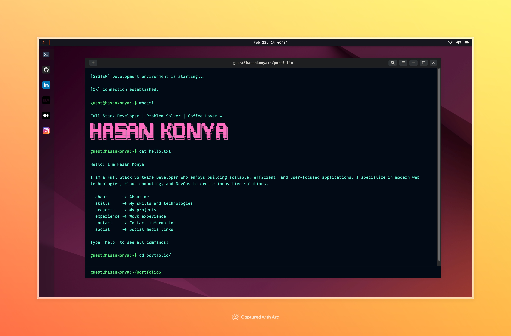

# Terminal Portfolio

<p align="center">
  
</p>

A modern, interactive terminal-style portfolio website built with JavaScript. Features command-line interface, custom animations, and real-time interactions. Includes social media integration, project showcase, and professional experience display.

## 🚀 Features

- 💻 **Terminal Interface**: Authentic terminal experience with command-line interaction
- 🌐 **Multilingual Support**: Available in English and Turkish
- 🎨 **Custom Animations**: Smooth transitions and terminal-like animations
- 📱 **Responsive Design**: Works seamlessly on desktop and mobile devices
- 🌙 **Dark/Light Mode**: Toggle between dark and light themes
- 🔍 **Command History**: Browse through previously executed commands
- 📂 **File System Simulation**: Navigate through a virtual file system

## 🛠️ Commands

| Command | Description |
|---------|-------------|
| `help` | Display available commands |
| `about` | View personal information |
| `skills` | List technical skills |
| `projects` | Show project portfolio |
| `experience` | Display work experience |
| `contact` | Show contact information |
| `social` | Display social media links |
| `clear` | Clear terminal screen |
| `history` | Show command history |
| `ls` | List directory contents |
| `cd` | Change directory |
| `pwd` | Print working directory |
| `date` | Show current date/time |
| `whoami` | Display user info |
| `setlocale` | Change language |

## 🔧 Technologies Used

- HTML5
- CSS3
- JavaScript (ES6+)
- Font Awesome Icons
- Custom Terminal Engine

## 🚀 Getting Started

1. Clone the repository:
   ```bash
   git clone https://github.com/hkonya/terminal-portfolio.git
   ```

2. Navigate to project directory:
   ```bash
   cd terminal-portfolio
   ```

3. Open `index.html` in your browser or use a local server:
   ```bash
   # Using Python
   python -m http.server 8000
   
   # Using Node.js
   npx serve
   ```

## 🎨 Customization

1. Edit personal information in `js/terminal/commands/about.js`
2. Modify skills in `js/terminal/commands/skills.js`
3. Update projects in `js/terminal/commands/projects.js`
4. Change experience in `js/terminal/commands/experience.js`
5. Update social links in `js/terminal/commands/social.js`

## 🌍 Localization

- Edit translations in `locales/en.js` and `locales/tr.js`
- Use `setlocale` command to switch languages
- Add new languages by creating additional locale files

## 📝 License

This project is licensed under the MIT License - see the [LICENSE](LICENSE) file for details.

## 🤝 Contributing

Contributions, issues, and feature requests are welcome! Feel free to check [issues page](https://github.com/hkonya/terminal-portfolio/issues).

## 📬 Contact

Hasan Konya - [@hasankny](https://linkedin.com/in/hasankny)

Project Link: [https://github.com/hkonya/terminal-portfolio](https://github.com/hkonya/terminal-portfolio)
